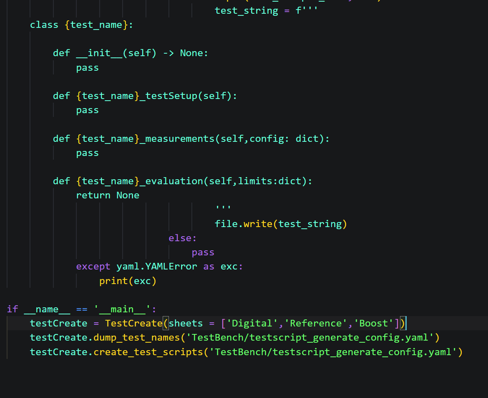
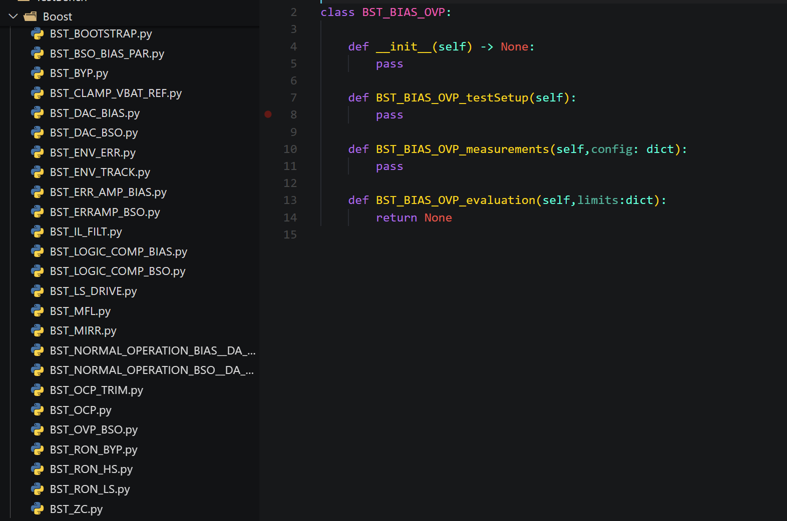

<h1 style="color:#ffaa00; border-bottom: 2px dotted #ff00aa" >Generate Test scripts </h1>

before generating the test scripts we have to generate the which are tests exists in the ```IVM6311_Testing_scripts.xlsx``` test script 

<h3>Generate the Test Scripts configuration yaml file </h3>

* Run method ``` dump_test_names(self,testscripts_generate_config_file_path:Path) ``` from testCreate.py 

* Provide testscripts_generate_config_file_path yaml file path as input to store all the tests 
* If you run the following dump_test_names from testCreate.py  you can see test scripts config file under the test bench repository <br>
 ``` 
    if __name__ == '__main__': 
    testCreate = TestCreate(sheets = ['Digital','Reference','Boost']) 
    testCreate.dump_test_names('TestBench/testscript_generate_config.yaml') 
``` 
</br>

* Run testCreate script from terminal ``` python testCreate.py```

* ```testscript_generate_config.yaml``` : <br>
```
TestBench:
  Boost:
    - BST_MIRR
    - BST_RON_LS
    - BST_RON_HS
    - BST_RON_BYP
    - BST_LS_DRIVE
    - BST_BYP
    - BST_LOGIC_COMP_BSO
    - BST_LOGIC_COMP_BIAS
    - BST_IL_FILT
    - BST_ERRAMP_BSO
    - BST_ERR_AMP_BIAS
    - BST_CLAMP_VBAT_REF
    - BST_BSO_BIAS_PAR
    - BST_MFL
    - BST_DAC_BSO
    - BST_DAC_BIAS
    - BST_OCP_TRIM
    - BST_OVP_BSO
    - BST_BIAS_OVP
    - BST_ENV_TRACK
    - BST_ZC
    - BST_NORMAL_OPERATION_BSO__DA_RIVEDERE_
    - BST_NORMAL_OPERATION_BIAS__DA_RIVEDERE_
    - BST_BOOTSTRAP
    - BST_ENV_ERR
    - BST_OCP
  Digital:
    - BIST
    - PAD_LOOPBACK
    - SCAN
  Reference:
    - UVLO
    - VBGR_ADJ_TRIM
    - OUT_TEST_FRO_VVCO
    - OUT_TEST_FRO_IMSB
    - TSDN
    - REF_LDO
    - FRO_CLOCK
```

* Every time you add new test in ```IVM6311_Testing_scripts.xlsx``` you have to run the ```dump_test_names``` method in testCreate.py script to generate the configuration file 

<h3> Create the Test Script </h3>

- Run ```create_test_scripts(self,testscripts_generate_config_file_path:Path):``` method from testCreate.py script by providing the ```testscripts_generate_config_file_path``` as input, which is generated by ```dump_test_names(self,testscripts_generate_config_file_path:Path)``` method 
- 
``` 
if __name__ == '__main__':
    testCreate = TestCreate(sheets = ['Digital','Reference','Boost'])
    testCreate.dump_test_names('TestBench/testscript_generate_config.yaml')
    testCreate.create_test_scripts('TestBench/testscript_generate_config.yaml')
```

- you can write the test template according to  the requiremnt example:

``` 
 class {test_name}:

        def __init__(self) -> None:
            pass
        
        def {test_name}_testSetup(self):
            pass 
        
        def {test_name}_measurements(self,config: dict):
            pass
        
        def {test_name}_evaluation(self,limits:dict):
            return None

```

- If Test already exists program wont over write the test script untill you force manually 
-  